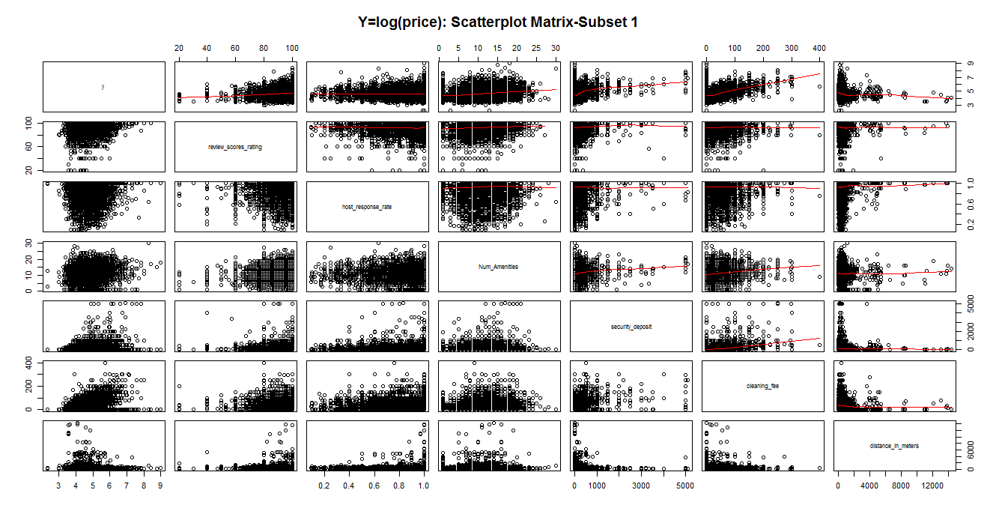
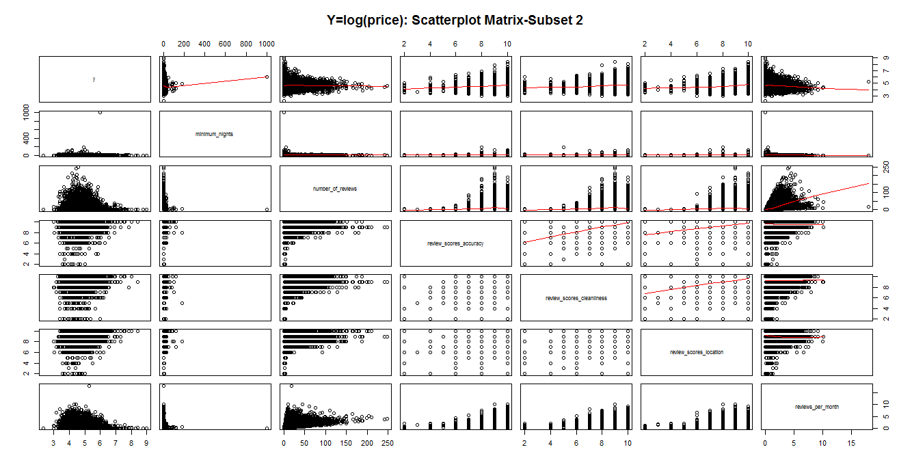

```{r knitr_options, include=FALSE, warning=FALSE,message=FALSE}
package_list <- c("knitr","ggplot2","RTextTools",
                  "leaflet","maps","data.table",
                  "dplyr","reshape2",
                  "MASS","rpart","glmnet","gam","sp",
                  "rgdal","rgeos","ggthemes","maptools",
                  'mapproj', 'digest',"rlang","bindrcpp",
                  'glue','pkgconfig','tibble',"ggmap")
for(i in 1:length(package_list)){
  if(package_list[i]=="ggmap"){
    devtools::install_github("dkahle/ggmap")
  }
  else if(!(package_list[i] %in% installed.packages())){
    install.packages(package_list[i])
  } 
}

devtools::install_github("dkahle/ggmap")

library(knitr)
library(ggplot2)
library(RTextTools)
library(leaflet)
library(maps)
library(data.table)
library(dplyr)
library(ggmap)
library(reshape2)
library(MASS)
library(rpart)
library(glmnet)
library(gam)
library(sp)
library(rgdal)
library(rgeos)
library(ggthemes)
library(maptools)
opts_chunk$set(tidy.opts=list(width.cutoff=50))

set.seed(123)
```

## Introduction

```{r test-main, child='christine_intros.Rmd'}
```

## Dataset

### Data Source

We used publicly available Airbnb listings data from http://insideairbnb.com/. We limited the scope of our analysis to New York City. The original dataset contained 94 information fields for 30,480 listings in the NYC area.

### Prep and Cleaning


```{r test-main, child='datacleaningtext.Rmd'}
```

```{r test-main, child='datacleaningcode.Rmd'}
```

## EDA

```{r, child='chris_eda.Rmd'}
```

```{r, child='alimu_eda.Rmd'}
```

```{r, child='maura_kmeans.Rmd'}
```

## Model Results and Diagnostics

### 1) Mann-Whitney Wilcoxon test

```{r, child='chris_mann.Rmd'}
```


### 2) Classification for predicting y:superhost and neighborhood

```{r, child='alimu_QDA_LDA_analysis.Rmd'}
```

```{r, child='alimu_tree_analysis.Rmd'}
```

### 3) ANOVA analysis

```{r, child='chris_anova.Rmd'}
```

### 4) Lasso regression for predicting y:price

```{r, child='christine_lassoREV.Rmd'}
```

### 5) Non-linear models: splines + GAM 

```{r, child='christine_GAMonpriceREV.Rmd'}
```

```{r, child='gam_maura.Rmd'}
```

## Findings Summary: Comparing the models

#### Some counter-intuitive insights gleaned from Explorative Data Analysis and Regression analyses

-??? The majority of airbnb listings have a very high review rating score of 90+ - does this suggest review ratings overall may not help distinguish between the true attractiveness or quality of listings as much as we would have thought?

-??? There is not a high association between the variables of price and review rating score per our regression coefficient output;

- While our custom-created variable *Distance to Nearest Subway* does not appear to be a meaningful predictor of either *Price* or *Superhost* status, we noticed in our GAM regression that *review_scores_location* variable has a very statistically significant positive coefficient in its relationship to *Price*. Perhaps the preference for proximity to public transportation is reflected instead in this variable;

-??? To our surprise, the average Airbnb rental price for listings in Manhattan is lower than those for other boroughs, we suspect due to a much higher number of host listings and thus more intense competition within the Manhattan market.

#### Inference-based analyses on the Price variable vs. Property/Room Type and Superhost Status

-??? Our ANOVA analysis demonstrates a real difference in price based on both property type and room type.

-??? The Mann-Whitney-Wilcox tests points to a difference in price range/distribution based on whether or not a host is a superhost.

-??? We can infer from the decision trees models value ranges that would lead to a host being a superhost: high number of reviews, high review score, high host response rate, and high rate of reviews per month.

####Regression Models: Linear Regression with Lasso & General Addictive Models

-??? Applying a Lasso regression with regularization to infer about the subset of predictor variables having non-zero explanatory power for the Price variable, we learned that two major groups of predictors appear to have more meaningful coefficients than the rest - predictors on host information and neighborhoods.

-??? From our GAM models on the Price variable, we can see from the Summary output of our highest performing gam.6 model that the most meaningful predictors with the highest relevance in this regression are: *room_type*, *review_scores_location*, *ns(security_deposit, 4)*, *review_scores_accuracy*, and *ns(Num_Amenities, 4)*. [Note: ```ns()``` indicates a natural spline technique on the variable was applied]. Furthermore, we were able to conclude with an ANOVA analysis on the different models that several variables do appear to have a non-linear relationship with the y variable.

-??? We were also able to fit a highly significant GAM model on logged price. While the MSE of this model is larger than the MSE of the price model alone when predictions are put on a non-logged scale, we would recommend further analysis before drawing conclusions that a linear relationship is better than a log-linear one here. (It's possible that high residuals on the outliers make MSE a less reliable comparison if we care less about the outliers).

## Conclusions

The results of this project are based on our collaborative work over the course of a short period of time. Given more time, we would like to test additional information such as neighborhood population density, household income, and zoning information (% residential) as well as use more sophisticated techniques such as machine learning and natural language processing.

# Appendix

## R Code

### General Data Exploration





#### Correlation of each Variable with Price

```{r, cache=TRUE, echo=FALSE, eval=TRUE, tidy=TRUE, warning=FALSE,message=FALSE}
# Correlation between each numeric variable and price
kable(AllCor, digits=2)
```

### Data Manipulation and Cleaning

#### General Data Cleaning

##### Variables Excluded

Because image and text analysis are out of scope for this project, the following variables in the original dataset were not considered for this analysis:

```{r, echo=FALSE}
drop.1 <- c("listing_url","summary","description"
,"notes","thumbnail_url","picture_url","host_url","host_thumbnail_url"
,"name","space","neighborhood_overview","transit","medium_url","xl_picture_url"
,"host_about","host_picture_url")

print(drop.1)
```

Some variables were excluded due to having little or no information in New York listings:

```{r, echo=FALSE}
drop.2 <- c("jurisdiction_names","requires_license",
            "experiences_offered" ,"square_feet","license")
print(drop.2)

```

Others were redundant or not relevant for this analysis.

```{r, echo=FALSE}
drop.3 <- c("scrape_id","host_location",
"neighbourhood","smart_location",
"country","weekly_price",
"calendar_last_scraped","availability_30",
"last_review",
"city",
"host_neighbourhood","last_scraped",
"street","market",
"country_code","calendar_updated",
"monthly_price","has_availability",
"availability_90","first_review",
"host_listings_count","state",
"host_name")

print(drop.3)
```


```{r test-main, child='datacleaningcode.Rmd', eval=FALSE}
```

### EDA

```{r, child='chris_eda_code.Rmd'}
```

```{r, child='alimu_average_price_zipcode_code.Rmd'}
```

```{r, child='maura_kmeans_code.Rmd'}
```

### Models

```{r, child='chris_mann_code.Rmd'}
```

```{r, child='alimu_LDA_code.Rmd'}
```

```{r, child='alimu_QDA_code.Rmd'}
```

```{r, child='alimu_tree_code.Rmd'}
```

```{r, child='chris_anova_code.Rmd'}
```

```{r, child='lasso_christine.Rmd'}
```

```{r, child='maura_gam_w_cv_code.Rmd'}
```

## Tables

### Neighborhood Clusters

#### Number of listings by neighbohood and cluster

```{r, echo=FALSE, tidy=TRUE, warning=FALSE,message=FALSE}
kable(table(airbnb$neighbourhood_cleansed, gsub("cluster.", "", airbnb$neighborhood_cluster)))
```