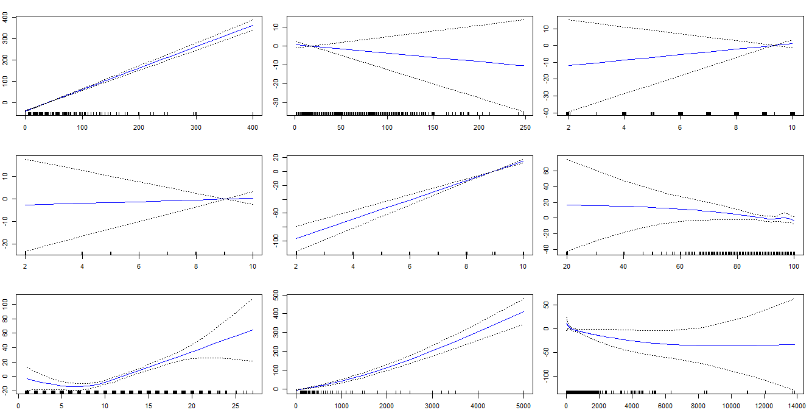
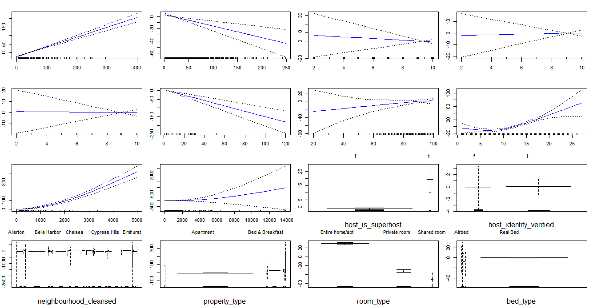
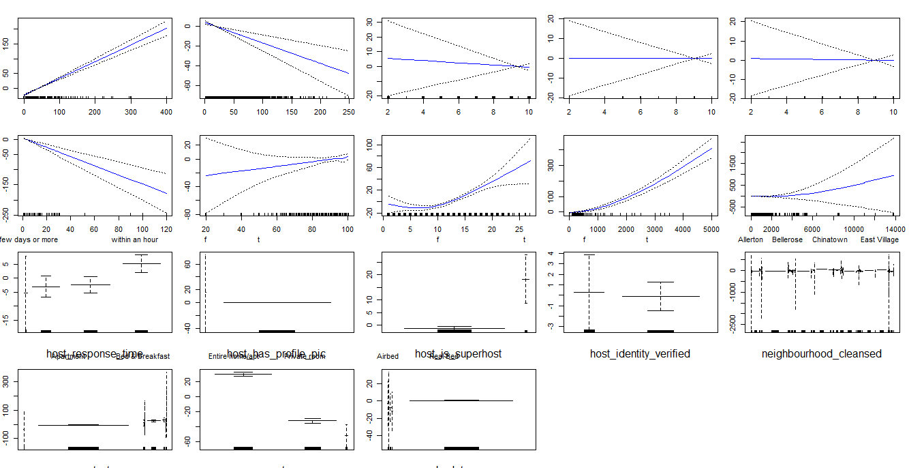

#### Exploring GAM regression models with linear & non-linear variables on Y var as price 

Given our vast list of predictor variables, we wished to construct a model incorporating non-linear approaches on some of our predictors. We therefore turned to the Generalized Additive Model (GAM) approach.
We first set out to construct an appropriate GAM model with the dependent variable as price. In the next section, we explored GAM models with the dependent variable as $\log(y)$.


#### Initial iterations: Testing whether some variables have a non-linear relationship with Y

We experimented with our first 2 models *gam.2* and *gam.3* to explore whether several predictor variables - *review_scores_rating*, *num_amenities*, *security_deposit*, *distance_in_meters* - have a non-linear relationship with our *y* variable. Within the GAM model, we apply a natural spline technique to these variables in question. 

With the below ANOVA test on *gam.2* and *gam.3* models, where in *gam.2* we did not apply the natural spline to the variables in question, we find that the very small p-value observed for *gam.3* model provides compelling evidence that a GAM with non-linear modeling of these variables is a better model than a GAM with only linear modeling of these variables. 

With this in mind, we move ahead to build on *gam.3* by adding more categorical variables to our *gam.4* model, whose categorical variables are shown in the *gam.4* plot below. 


**ANOVA on gam.2 and gam.3 models to assess non-linearity**

```{r, cache=TRUE, echo=FALSE, eval=TRUE, tidy=TRUE, warning=FALSE,message=FALSE}
exclusions <- c("id", "host_id", "host_since", "host_name", "latitude", "longitude", "cleaning_fee", "security_deposit", "extra_people", "neighbourhood_cleansed", "is_location_exact","host_verifications","amenities")
gam.dataset <- air.bnb.dataset[, !(names(air.bnb.dataset) %in% exclusions)]

gam.dataset <- gam.dataset[complete.cases(gam.dataset),]


gam.2 <- gam(price ~  review_scores_rating+  num_amenities+  number_of_reviews+  review_scores_accuracy+  review_scores_cleanliness+  review_scores_location+  distance_in_meters,  data=gam.dataset) 

gam.3 <- gam(price~   number_of_reviews+  review_scores_accuracy+  review_scores_cleanliness+  review_scores_location+  ns(review_scores_rating,4)+ #set to 4 deg of freedom 
 ns(num_amenities,4)+  ns(distance_in_meters,4),  data=gam.dataset)


gam.4 <- gam(price~  number_of_reviews+  review_scores_accuracy+  review_scores_cleanliness+  review_scores_location+  minimum_nights+  ns(review_scores_rating,4)+ #set to 4 deg of freedom 
ns(num_amenities,4)+  ns(distance_in_meters,4)+  host_is_superhost+ host_identity_verified+ property_type+ room_type+ bed_type, data=gam.dataset)     


gam.6 <- gam(price~ number_of_reviews+ review_scores_accuracy+ review_scores_cleanliness+  review_scores_location+ minimum_nights+  ns(review_scores_rating,4)+  ns(num_amenities,4)+   ns(distance_in_meters,4)+  host_response_time+ # added in gam.6 due to Lasso results 
              host_has_profile_pic+ # added in gam.6 due to Lasso results 
              host_is_superhost+  host_identity_verified+  property_type+  room_type+ bed_type,  data=gam.dataset)
```


```{r}
anova(gam.2, gam.3, test="F")

```

**Gam.3 plot: Plots of the relationship between each feature and the response in the fitted model**



**Gam.4 plot: Plots of the relationship between each feature and the response in the fitted model**



#### Next iteration: Assessing different versions of GAM models

We explored different versions of GAM models by layering on more variables, as well as variables modeled in a non-linear approach to earlier models. In other words, our earlier GAM versions are subsets of the later GAM versions so we can sequentially compare the simpler model to the more complex models. This must be so in order to apply the ```ANOVA()``` function to test the null hypothesis that a model $M_1$ is sufficient to explain the data against the alternative hypothesis that a more complex model $M_2$ is required. 

We finally arrived at a subset of variables for our last *gam.6* model by adding a few more predictors which we learned from the Lasso regression earlier carried meaningfully large non-zero coefficients, namely *host_response_time* and *host_has_profile_pic*. 


**Overview of four different GAM models we explored**
```
> gam.2=gam(price ~ 
+                  review_scores_rating+
+                  Num_Amenities+
+                  cleaning_fee+
+                  number_of_reviews+
+                  review_scores_accuracy+
+                  review_scores_cleanliness+
+                  review_scores_location+
+                  distance_in_meters,
+                 data=datagam)

> gam.3=gam(price~               
+                  cleaning_fee+
+                  number_of_reviews+
+                  review_scores_accuracy+
+                  review_scores_cleanliness+
+                  review_scores_location+
+                  ns(review_scores_rating,4)+ #set to 4 deg of freedom
+                  ns(Num_Amenities,4)+
+                  ns(security_deposit,4)+
+                  ns(distance_in_meters,4)

> gam.4=gam(price~               
+             cleaning_fee+
+             number_of_reviews+
+             review_scores_accuracy+
+             review_scores_cleanliness+
+             review_scores_location+
+             minimum_nights+
+             ns(review_scores_rating,4)+ #set to 4 deg of freedom
+             ns(Num_Amenities,4)+
+             ns(security_deposit,4)+
+             ns(distance_in_meters,4)+
+             host_is_superhost+
+           host_identity_verified+
+           neighbourhood_cleansed+
+           property_type+
+           room_type+
+           bed_type,
+           data=datagam)

> gam.6=gam(price~               
+             cleaning_fee+
+             number_of_reviews+
+             review_scores_accuracy+
+             review_scores_cleanliness+
+             review_scores_location+
+             minimum_nights+
+             ns(review_scores_rating,4)+ 
+             ns(Num_Amenities,4)+
+             ns(security_deposit,4)+
+             ns(distance_in_meters,4)+
+             host_response_time+ # added in gam.6 due to Lasso results
+             host_has_profile_pic+ # added in gam.6 due to Lasso results
+             host_is_superhost+
+             host_identity_verified+
+             neighbourhood_cleansed+
+             property_type+
+             room_type+
+             bed_type,
+           data=datagam)

```

**Gam.6 model with most complete model subset: Plots of the relationship between each feature and the response in the fitted model**




#### ANOVA model evaluation of above four GAM models

Based on the results of an ANOVA analysis of four GAM models - *gam.2, gam.3, gam.4*, and *gam.6* - we find that the miniscule p-value for *gam.4* of $< 2.2 \times 10^{-16}$ provides evidence the *gam.4* model, which contains an additional set of categorical predictors vs. *gam.3*'s subset, offers a better model fit than the earlier models. 

Meanwhile, the p-value for *gam.6* of 0.025 in the ANOVA results suggests there is some evidence that the addition of the last model's predictors (suggested by our Lasso regression) collectively contribute to a better model fit, vs. the previous model *gam.4* which did not include those predictors. 


```{r}

anova(gam.2, gam.3, gam.4, gam.6, test="F")

```

#### Selecting best model on performance based on AIC criteria

Finally, to apply another model performance assessment measure, we compared the AIC score across the above 4 GAM models. Our last model *gam.6* with the largest set of predictors achieved the lowest AIC score, suggesting this model, among the four we explored, is potentially GAM model offering the best model fit and predictive ability for *y* variable price. 


```{r}

AIC(gam.2)
AIC(gam.3)
AIC(gam.4)
AIC(gam.6)


```

**Summary of GAM model fit for gam.6**
```{r}
summary(gam.6)

```


