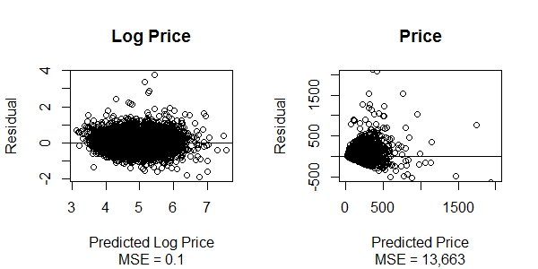

### Generalized Additive Models for Log Price

#### Why Model Logged Price

Due to the nature of housing prices, it makes sense intuitively to test a multiplicative relationship between predictors rather than something strictly additive (For example, having an extra bedroom might be correlated with a larger (absolute dollar amount) increase in price in a pricy neighborhood than in a cheaper one.).  Because the raw price variable looks closer to an exponential distribution than a normal one, we logged it in many of our earlier visualizations and it looks like some of the variables have a relationship with the log providing further motivation for using the log of price as the dependant variable.

(Because the dependent variable has been logged, individual variable contributions should be interpreted as lifts percentage-wise to the non-logged price rather than dollar contributions.)

#### Variable and Parameter Selection

In order to better understand the relationships between explanatory variables and log price, we wanted to test for non-linear relationships as well as linear ones. We decided to try a generalized additive (in relation to the log) model in oto due this.

Before looking into non-linearity in the predictors, we first used an OLS regression to help us pick predictors.  Due to the size of the dataset and number of predictors, many stepwise and subset selection models were too computationally expensive and those that did run (forward stepwise, lasso) did not result in usable subets.  Therefore, we ran a linear regression using all the variables and looked at their statistical significance.  (Fees and Neighborhoods were not included in this regression.)

```{r, echo=FALSE, tidy=TRUE, warning=FALSE,message=FALSE}
kable(read.csv("regcogt10.csv"), caption="Highly Significant OLS Variables", digits=2)
```

The original baseline GAM Model included all variables which were highly significant (absolute value of T-Stat >10) in the OLS regression, except for neighborhood clusters (Some of the clusters had too few listings after missing ratings scores were removed to hold up to cross validation.).  It also included all ratings and distance from subway because we were interested in transformations of those.

Next, we ran a GAM model and looked at it's RMSE as well as a testing RMSE (Average of 10 10-fold cross validation RMSEs).  We tested models with different tranformations and compared both testing and training RMSEs

```{r, echo=FALSE, tidy=TRUE, warning=FALSE,message=FALSE}
maura.gam<-read.csv("gam_results.csv")[,-1]
names(maura.gam)<-c("Model", "Training RMSE", "Testing RMSE")
kable(maura.gam, caption="Summary of Models Tested", digits=4)
```

We tested logs as well as smoothing parameters (on variables with ranges large enough to support them) for quantitative variables.  Most did not have a large enough/noticable effect on the testing RMSE to justify them (even if non-linearity was statistically sigificant), but a few did.  Two of the ratings variables were never significant in the model and removed (which reduced testing error).  Final model output is below:

```{r, echo=FALSE, tidy=TRUE, warning=FALSE,message=FALSE}
kable(read.csv("gam_parametric_anova.csv"), caption="Anova for Parametric Effects", digits=2)
kable(read.csv("gam_nonparametric_anova.csv"), caption="Anova for Non-Parametric Effects", digits=2)
```

The AIC of this model is 12,254 and the BIC is 12,430.  (Without non-parametric effects, AIC = 12,467 and BIC = 12,642.)  All variables and effects are statistically significant.



Residuals on the log price are fairly normally distributed.  Looking at the predicted value in terms of the actual price, the model pretty clearly doesnt predict higher prices as accurately as lower ones (a function of the log transformation.)

Looking at the model coefficients, space (accomodates, bedrooms, bathrooms, privacy) are predictors of higher prices.  So are indoor fireplaces, doormen, Cable TV and Air Conditioning.  Most of the review scores are positive predictors.  The few that are negative have small coefficients and are probably balancing out the other review variables (all are highly correlated).  Being closer to Manhatten and the subway are predictors of pricier listings. Minimum nights is a negative predictor of price.

